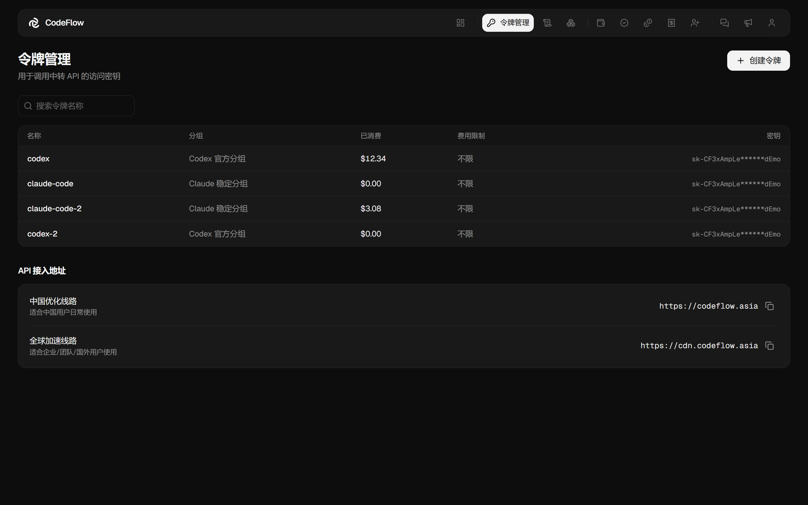
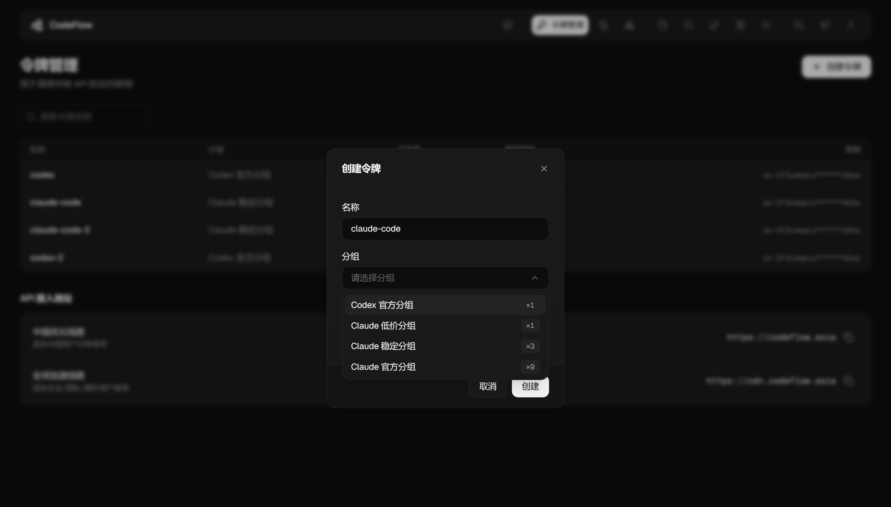

# 接入前置：Base URL 与 API 令牌

接入任何工具均需两项配置：**接口地址（Base URL）** 与 **API 令牌**。

## Base URL

将工具原本指向官方的接口地址（如 `https://api.anthropic.com`）替换为本站地址，请求即经本站转发至上游，参数与返回结果与官方一致。

地址在控制台 **令牌管理** 页面下方的「API 接入地址」区域获取，支持一键复制。

|线路|地址|适用场景|
|---|---|---|
|中国优化线路|`https://codeflow.asia`|中国用户日常使用|
|全球加速线路|`https://cdn.codeflow.asia`|企业／团队／国外用户|

两条线路的账号、令牌与余额通用，可随时切换。

> 注意：部分工具要求地址末尾带 `/v1`，部分不要。**Claude Code、Cherry Studio（Anthropic 供应商）、OpenClaw** 填写不带 `/v1` 的地址，工具自行补全；**Cursor、Kilo Code、OpenCode、Codex** 填写带 `/v1` 的地址。
>
> 此规则与协议种类无关（OpenCode 使用 Anthropic 协议，同样需要 `/v1`），请勿自行按协议推断。各工具章节均已注明应填形式。
>
>

## API 令牌

在 **令牌管理 → 创建令牌** 中生成。

创建对话框含三个字段：

|字段|说明|
|---|---|
|名称|仅用于自行标识。建议按用途命名（如 `claude-code`、`cursor`），便于对照账单|
|分组|决定可调用的模型范围与计费倍率，见下节|
|费用限制|该令牌累计消费的上限，单位为美元。达到上限后该令牌的调用被拒绝，不影响其他令牌与账户余额。留空则不限制|

费用限制约束的是**累计总额**，非每日额度；达到上限后在列表中调高即可，无需重建令牌。

> 注意：令牌仅在创建时完整显示一次，请当场复制保存。列表「密钥」列永久打码，事后无法找回。令牌丢失时删除原令牌并重新创建即可。
>
>

### 令牌保管

- 不要提交至 git。本文所列配置文件均位于用户目录下，请勿复制到项目目录。Claude Code 亦会读取项目内的 `.claude/settings.json`，该文件默认被 git 跟踪。确需置于项目内时，请先将路径加入 `.gitignore`。
- 不要写入会被分享的内容，包括团队配置模板、Docker 镜像、CI 变量，以及 `~/.bashrc` 等会同步至 dotfiles 仓库的文件。
- 提交日志、截图或 issue 前请先脱敏，终端回显与报错信息中亦可能包含令牌。
- 疑似泄露时，在 **令牌管理** 中删除并重新创建，填回工具即可，原令牌立即失效，不影响余额与订阅。
- 为令牌设置「费用限制」。升级后有效期与模型／IP 限制已下线，此项为令牌层面唯一的止损手段。

## 分组与计费倍率

创建令牌时选择的分组，决定该令牌走哪个上游号池、可调用哪些模型，以及**计费倍率**。倍率直接乘在模型单价上。

|分组|说明|可调用模型|计费倍率|
|---|---|---|---|
|Claude 低价分组|Kiro 反代号池，缓存命中率高|Claude 系列（`claude-*`）|×1|
|Codex 官方分组|官方混合号池，稳定不降智|GPT 系列（`gpt-*`）|×1|
|Claude 稳定分组|混合反代分组，目前稳定|Claude 系列（`claude-*`）|×3|
|Claude 官方分组|Claude 官方 Max 20x 号池|Claude 系列（`claude-*`）|×9|

术语说明：**号池**指后台实际承接请求的上游账号集合；**反代**指经第三方通道转发，成本较低但多一跳；**官方**指直连官方订阅账号，成本较高但最接近原生；**不降智**指模型不会被上游替换为更低配版本。

选择建议：

|使用场景|建议分组|
|---|---|
|日常编码|Claude 低价分组（×1）|
|对稳定性要求高|Claude 稳定分组（×3）|
|要求官方号池|Claude 官方分组（×9）|
|Codex／GPT 系列|Codex 官方分组（×1）|

> 注意：分组与模型必须对应。Claude 分组的令牌无法调用 `gpt-*`，Codex 分组的令牌无法调用 `claude-*`，错配将返回 404。两类模型均需使用时，请分别创建两个令牌。
>
>
