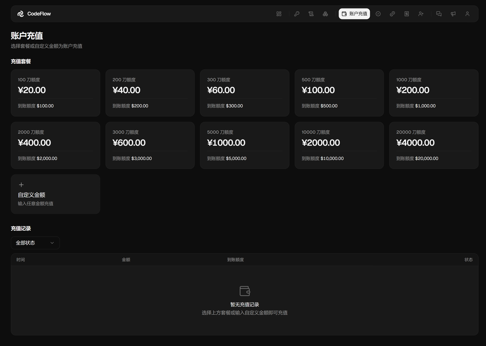
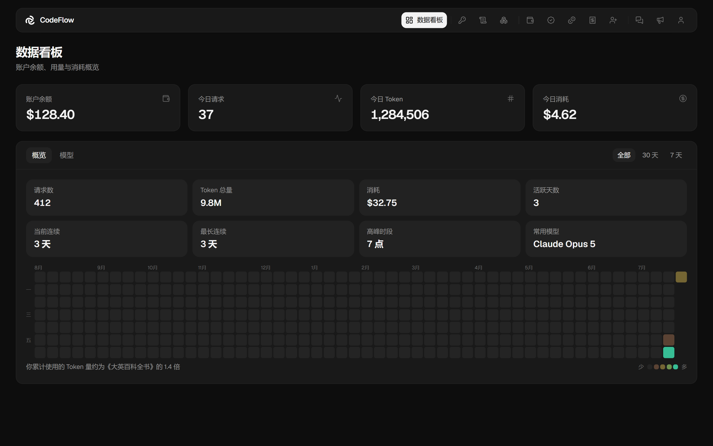
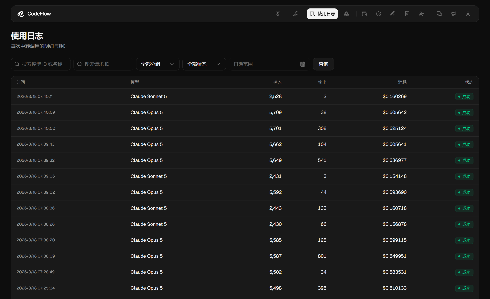

# 快速接入流程

## 1. 注册

访问 https://codeflow.asia/ ，点击「免费注册」。邮箱注册即可，无需海外手机号。

## 2. 充值

进入 **账户充值**，选择档位或输入自定义金额，支付宝付款，即时到账。

汇率固定公开：**¥1 = $5.00 额度**，各档位汇率一致，余额永不过期。最低 ¥1 起充。

## 3. 创建令牌

进入 **令牌管理 → 创建令牌**，填写名称、选择分组、按需设置费用限制，创建后当场复制密钥。

## 4. 配置工具

参照下文对应章节，填入接口地址与令牌。

## 5. 验证

启动工具并发起一次对话。返回正常即接入成功。

**数据看板** 显示账户余额、当日请求数、Token 用量与消耗：

**使用日志** 逐条显示每次调用的输入／输出 Token 与对应金额：

