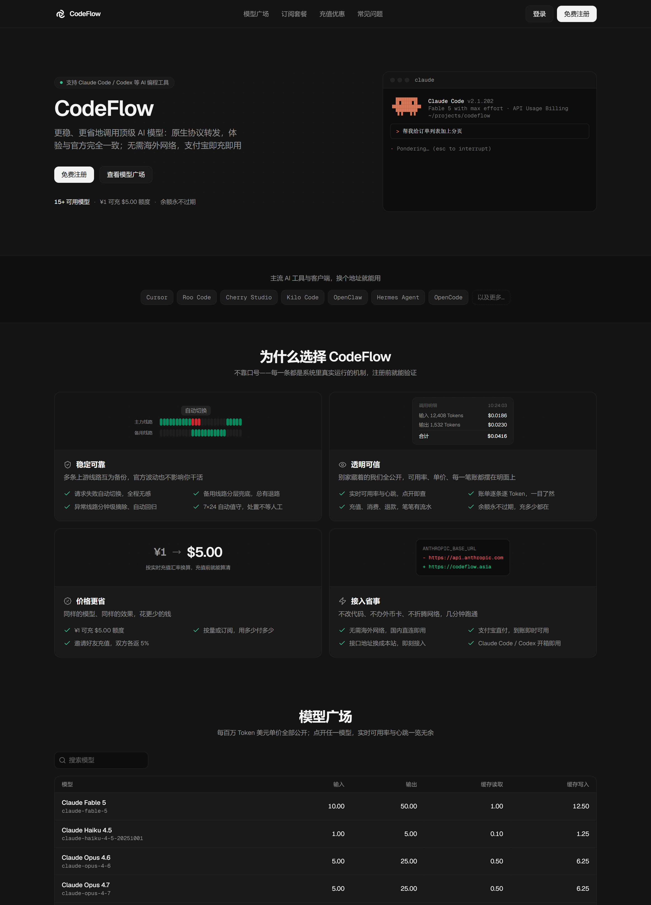

  <b>8</b> 个软件教程
  <b>29</b> 张步骤截图
  <b>100%</b> Markdown
  <i></i> 持续维护

## 选择你的工具

不用从头通读，找到你正在使用的软件，照着对应步骤配置即可。

<ToolGrid />

## 配置前先记住

  

    中国优化线路
    <code>https://codeflow.asia</code>
    
适合中国用户日常使用，账号、令牌与余额和全球线路互通。

  

  

    全球加速线路
    <code>https://cdn.codeflow.asia</code>
    
适合团队、企业和境外网络环境，可随时切换。

  

::: warning `/v1` 不能凭协议猜测
Claude Code、Cherry Studio 和 OpenClaw 填写不带 `/v1` 的地址；Cursor、Kilo Code、OpenCode 和 Codex 填写带 `/v1` 的地址。请以具体软件页面为准。
:::

  

    第一次使用？
    <h3>先完成令牌与分组准备</h3>
    
了解 Base URL、API 令牌、安全保管和计费分组，再进入软件教程。

  

[查看接入前置 →](/guide/access)

## 关于本指南

CodeFlow 站点地址：[https://codeflow.asia/](https://codeflow.asia/)

本文档说明如何将各类 AI 编程工具与客户端接入 CodeFlow。接入方式为替换接口地址与填入令牌，无需修改代码，无需海外网络环境。各工具章节相互独立，可按需查阅。

::: info 2026 年 7 月 22 日平台升级说明
原有 `sk-` 令牌继续有效，接入地址未变更，账户余额按 1:1 迁入，订阅剩余时长完整保留，客户端配置无需调整。历史调用明细与用量统计未迁移，消耗记录自升级日重新累计；邀请码全部更新，旧邀请链接失效；令牌不再支持单独设置有效期与模型/IP 限制，令牌层面仅保留“费用限制”。
:::
