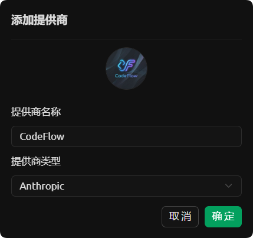
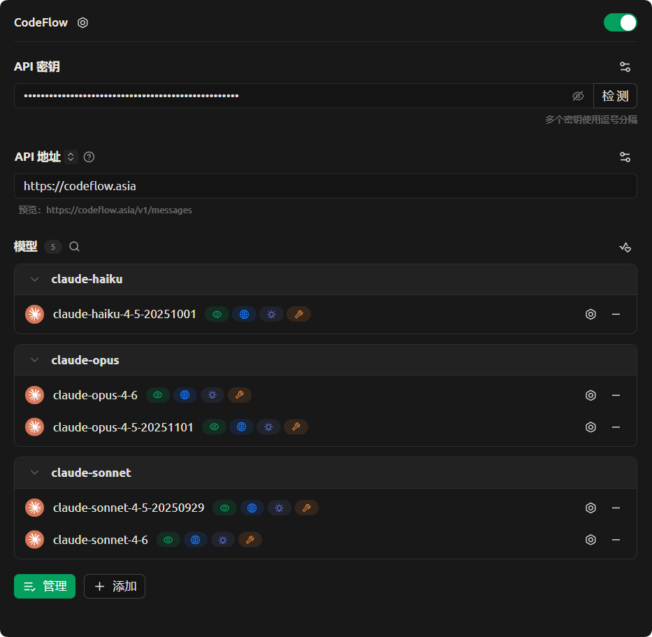
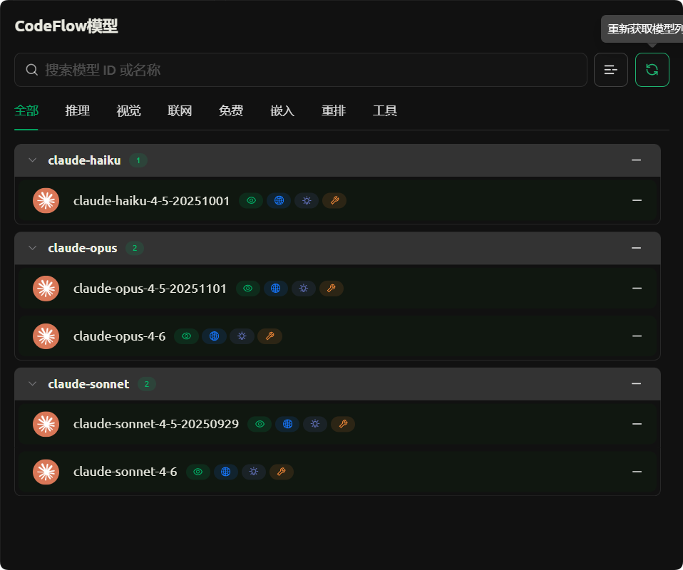
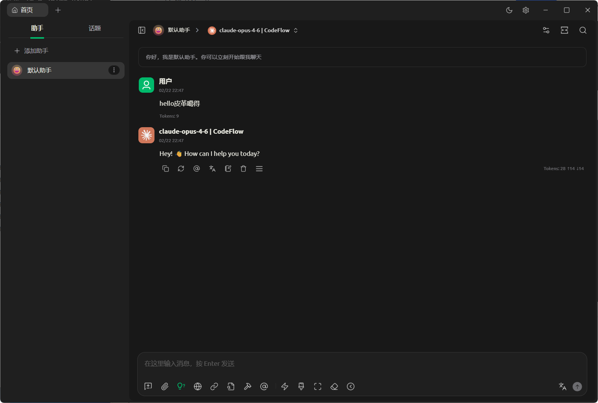

# Cherry Studio配置API Key指南

下载安装 Cherry Studio https://www.cherry-ai.com/ 或者 https://cherrystudiochina.com/

|配置项|填写内容|
|---|---|
|提供商类型|Anthropic|
|API 地址|`https://codeflow.asia`（不带 `/v1`）|
|API 密钥|您的 CodeFlow 令牌|
|令牌分组|Claude 系列分组|

## 打开设置-->模型服务-->添加

## 提供商类型选择Anthropic，确定

## 配置API地址和API Key，并点击底部管理。

## 点击刷新按钮，会自动获取模型，添加图中所列出模型。

## 使用最新模型对话。

