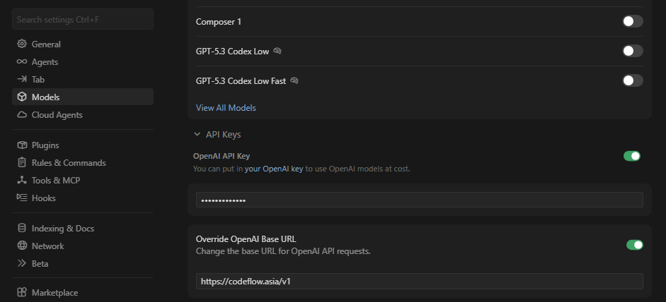
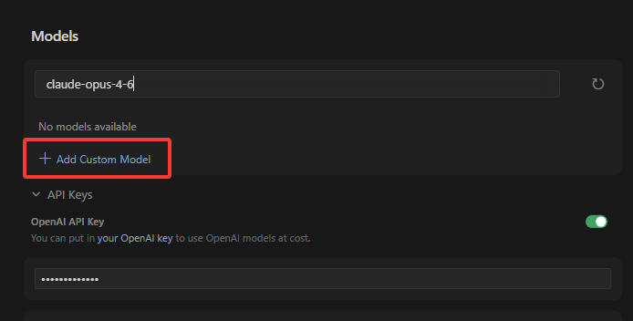
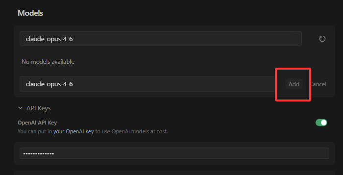
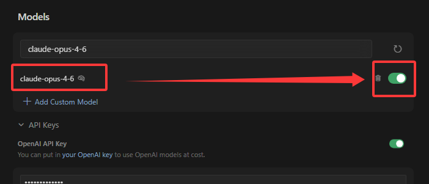
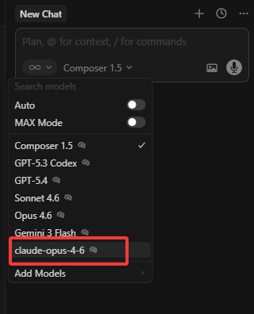

# Cursor配置API Key指南

在开始操作前，请确保 Cursor Pro 及以上账号。

按照以下步骤完成接入，即可通过本平台使用 CodeFlow 模型调用服务。

|配置项|填写内容|
|---|---|
|Override OpenAI Base URL|`https://codeflow.asia/v1`|
|OpenAI API Key|您的 CodeFlow 令牌|
|令牌分组|调用 `gpt-*` 选 Codex 官方分组；调用 `claude-*` 选 Claude 系列分组|

## 打开Settings-->Models

## 启用API Keys中的`OpenAI API Key`与`Override OpenAl Base URL`

## 配置`OpenAI API Key`

## `Override OpenAl Base URL`

## 划回最上层，添加需要调用的模型

## 启用该模型

## 回到会话启用模型

