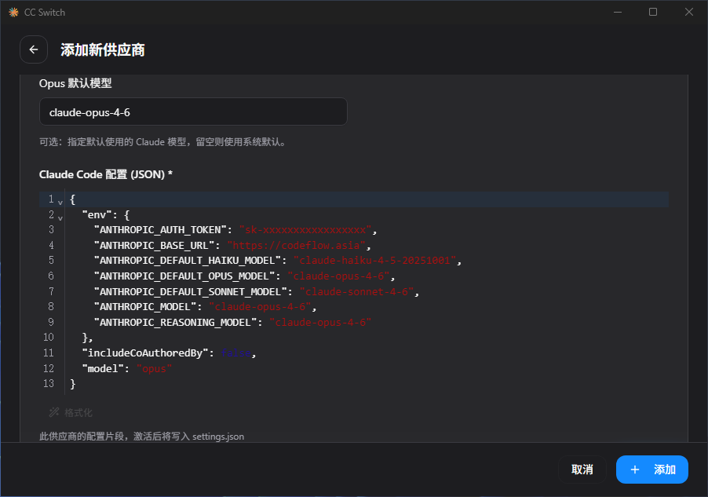
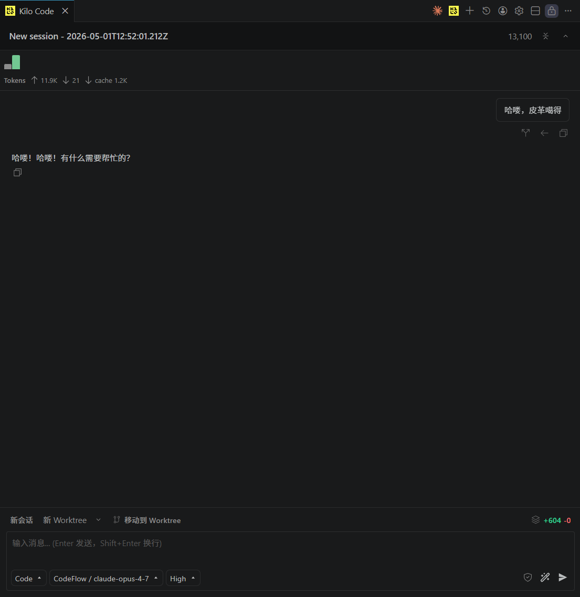

# VS Code 插件Kilo配置教程

|配置项|填写内容|
|---|---|
|基础 URL|`https://codeflow.asia/v1`|
|API 密钥|您的 CodeFlow 令牌|
|令牌分组|按需选择，决定可获取的模型范围|

## 1、首先我们进入设置→`提供商`

找到`自定义提供商`，点击`+ 连接`

## 2、填写**基础URL**

填入本站 **Base URL** 地址：`https://codeflow.asia/v1`

填写`基础URL`与`API密钥`后，Kilo 将自动获取**分组**可用的站内模型

## 3、提交

## 4、测试模型回复，回复成功即配置完成

## 5、即可输入提示词，进行使用。
